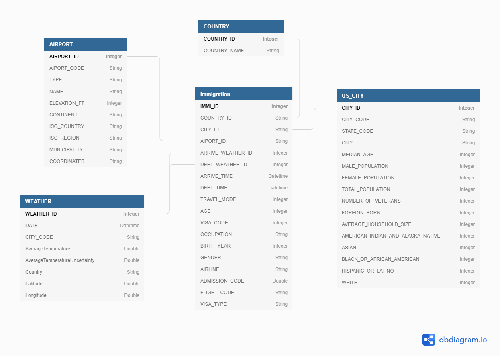

# pyspark-airflow-aws

### Data Source

- I94 Immigration Data: This data comes from the US National Tourism and Trade Office [Source](https://travel.trade.gov/research/reports/i94/historical/2016.html). This data records immigration records partitioned by month of every year.

|         | cicid   | i94yr | i94mon | i94cit | i94res | i94port | arrdate | i94mode | i94addr | depdate | i94bir | i94visa | count | dtadfile | visapost | occup | entdepa | entdepd | entdepu | matflag | biryear | dtaddto  | gender | insnum | airline | admnum   | fltno | visatype |
|---------|---------|-------|--------|--------|--------|---------|---------|---------|---------|---------|--------|---------|-------|----------|----------|-------|---------|---------|---------|---------|---------|----------|--------|--------|---------|----------|-------|----------|
| 2027561 | 4084316 | 2016  | 4      | 209    | 209    | HHW     | 20566   | 1       | HI      | 20573   | 61     | 2       | 1     | 20160422 |          |       | G       | O       |         | M       | 1955    | 7202016  | F      |        | JL      | 5.66E+10 | 782   | WT       |
| 2171295 | 4422636 | 2016  | 4      | 582    | 582    | MCA     | 20567   | 1       | TX      | 20568   | 26     | 2       | 1     | 20160423 | MTR      |       | G       | R       |         | M       | 1990    | 10222016 | M      |        | *GA     | 9.44E+10 | XBLNG | B2       |
| 589494  | 1195600 | 2016  | 4      | 148    | 112    | OGG     | 20551   | 1       | FL      | 20571   | 76     | 2       | 1     | 20160407 |          |       | G       | O       |         | M       | 1940    | 7052016  | M      |        | LH      | 5.58E+10 | 464   | WT       |
| 2631158 | 5291768 | 2016  | 4      | 297    | 297    | LOS     | 20572   | 1       | CA      | 20581   | 25     | 2       | 1     | 20160428 | DOH      |       | G       | O       |         | M       | 1991    | 10272016 | M      |        | QR      | 9.48E+10 | 739   | B2       |
| 3032257 | 985523  | 2016  | 4      | 111    | 111    | CHM     | 20550   | 3       | NY      | 20553   | 19     | 2       | 1     | 20160406 |          |       | Z       | K       |         | M       | 1997    | 7042016  | F      |        |         | 4.23E+10 | LAND  | WT       |

- Aiport Code table: [Source](https://datahub.io/core/airport-codes#data). Includes a collection of airport codes and their respective cities, countries around the world.

|ident|type         |name                |elevation_ft|continent|iso_country|iso_region|municipality|gps_code|iata_code|local_code|coordinates                       |
|-----|-------------|--------------------|------------|---------|-----------|----------|------------|--------|---------|----------|----------------------------------|
|00A  |heliport     |Total Rf Heliport   |11          |NA       |US         |US-PA     |Bensalem    |00A     |         |00A       |-74.93360137939453, 40.07080078125|
|00AK |small_airport|Lowell Field        |450         |NA       |US         |US-AK     |Anchor Point|00AK    |         |00AK      |-151.695999146, 59.94919968       |
  

- US City Demographic Data: This dataset comes from OpenSoft [Source](https://public.opendatasoft.com/explore/dataset/us-cities-demographics/export/). Includes population formation of US states, like race and gender.

|City            |State        |Median Age|Male Population|Female Population|Total Population|Number of Veterans|Foreign-born|Average Household Size|State Code|Race                     |Count|
|----------------|-------------|----------|---------------|-----------------|----------------|------------------|------------|----------------------|----------|-------------------------|-----|
|Quincy          |Massachusetts|41.0      |44129          |49500            |93629           |4147              |32935       |2.39                  |MA        |White                    |58723|
|Hoover          |Alabama      |38.5      |38040          |46799            |84839           |4819              |8229        |2.58                  |AL        |Asian                    |4759 |

- World temperature Data: This dataset comes from Kaggle [Source](https://www.kaggle.com/berkeleyearth/climate-change-earth-surface-temperature-data). Includes temperature recordings of cities around the world for a period of time

|dt  |AverageTemperature|AverageTemperatureUncertainty|City|Country|Latitude|Longitude|
|----|------------------|-----------------------------|----|-------|--------|---------|
|01/01/2013|6.32              |0.267                        |Abilene|United States|32.95N  |100.53W  |
|01/06/2013|20.892            |0.273                        |New York|United States|40.99N  |74.56W   |

### Data Model

