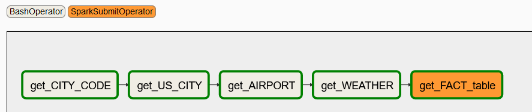

# pyspark-airflow-aws

### Data Source

- I94 Immigration Data: This data comes from the US National Tourism and Trade Office [Source](https://travel.trade.gov/research/reports/i94/historical/2016.html). 

|         | cicid   | i94yr | i94mon | i94cit | i94res | i94port | arrdate | i94mode | i94addr | depdate | i94bir | i94visa | count | dtadfile | visapost | occup | entdepa | entdepd | entdepu | matflag | biryear | dtaddto  | gender | insnum | airline | admnum   | fltno | visatype |
|---------|---------|-------|--------|--------|--------|---------|---------|---------|---------|---------|--------|---------|-------|----------|----------|-------|---------|---------|---------|---------|---------|----------|--------|--------|---------|----------|-------|----------|
| 2027561 | 4084316 | 2016  | 4      | 209    | 209    | HHW     | 20566   | 1       | HI      | 20573   | 61     | 2       | 1     | 20160422 |          |       | G       | O       |         | M       | 1955    | 7202016  | F      |        | JL      | 5.66E+10 | 782   | WT       |
| 2171295 | 4422636 | 2016  | 4      | 582    | 582    | MCA     | 20567   | 1       | TX      | 20568   | 26     | 2       | 1     | 20160423 | MTR      |       | G       | R       |         | M       | 1990    | 10222016 | M      |        | *GA     | 9.44E+10 | XBLNG | B2       |
| 589494  | 1195600 | 2016  | 4      | 148    | 112    | OGG     | 20551   | 1       | FL      | 20571   | 76     | 2       | 1     | 20160407 |          |       | G       | O       |         | M       | 1940    | 7052016  | M      |        | LH      | 5.58E+10 | 464   | WT       |
| 2631158 | 5291768 | 2016  | 4      | 297    | 297    | LOS     | 20572   | 1       | CA      | 20581   | 25     | 2       | 1     | 20160428 | DOH      |       | G       | O       |         | M       | 1991    | 10272016 | M      |        | QR      | 9.48E+10 | 739   | B2       |
| 3032257 | 985523  | 2016  | 4      | 111    | 111    | CHM     | 20550   | 3       | NY      | 20553   | 19     | 2       | 1     | 20160406 |          |       | Z       | K       |         | M       | 1997    | 7042016  | F      |        |         | 4.23E+10 | LAND  | WT       |

- Aiport Code table: This is a simple table of airport codes and corresponding cities.  [Source](https://datahub.io/core/airport-codes#data).

|ident|type         |name                |elevation_ft|continent|iso_country|iso_region|municipality|gps_code|iata_code|local_code|coordinates                       |
|-----|-------------|--------------------|------------|---------|-----------|----------|------------|--------|---------|----------|----------------------------------|
|00A  |heliport     |Total Rf Heliport   |11          |NA       |US         |US-PA     |Bensalem    |00A     |         |00A       |-74.93360137939453, 40.07080078125|
|00AK |small_airport|Lowell Field        |450         |NA       |US         |US-AK     |Anchor Point|00AK    |         |00AK      |-151.695999146, 59.94919968       |
  

- US City Demographic Data: This dataset comes from OpenSoft [Source](https://public.opendatasoft.com/explore/dataset/us-cities-demographics/export/). 

|City            |State        |Median Age|Male Population|Female Population|Total Population|Number of Veterans|Foreign-born|Average Household Size|State Code|Race                     |Count|
|----------------|-------------|----------|---------------|-----------------|----------------|------------------|------------|----------------------|----------|-------------------------|-----|
|Quincy          |Massachusetts|41.0      |44129          |49500            |93629           |4147              |32935       |2.39                  |MA        |White                    |58723|
|Hoover          |Alabama      |38.5      |38040          |46799            |84839           |4819              |8229        |2.58                  |AL        |Asian                    |4759 |

- World temperature Data: This dataset comes from Kaggle [Source](https://www.kaggle.com/berkeleyearth/climate-change-earth-surface-temperature-data). 

|dt  |AverageTemperature|AverageTemperatureUncertainty|City|Country|Latitude|Longitude|
|----|------------------|-----------------------------|----|-------|--------|---------|
|01/01/2013|6.32              |0.267                        |Abilene|United States|32.95N  |100.53W  |
|01/06/2013|20.892            |0.273                        |New York|United States|40.99N  |74.56W   |

### Data Model
The designed data model is as shown in the below digram:

The model follows a star schema with several dimensions and one fact table for query performance. The grain of the fact table is a transaction record for an immigrant. 
The dimension WEATHER is a role-playing dimension to query both the weather of arrival date and departure date. \
The model is designed for anyone who's interested in finding patterns in US immigration records. Questions like the following could be easily quried:

- Which US city is the most popular destination? 
- Does this popularity correlate with weather or immigrants' age, origin country or gender?
- Does the demographics of the city have anything to do with immigrants' preference of visits?
- Is it that less people are visiting US in the winter?

### Choice of tools

The project is implemented in Docker containers to priovide consistency and scalability.\
The ETL flow is orchestarted by AIRFLOW. Dimension tables are transformed by Pandas as they can be easily fit into memory. The fact table is transformed by Spark as its enormisity and multiple joins are required to add foreign keys to it. 

### ETL DAG

The ETL process is orchestrated by AIRFLOW. The airflow dag is implemented under /mnt/dags/dag.py. The graph of the dag is as follows:

1. **get_CITY_CODE**  (/mnt/dags/scripts/task1.py):\
Read I94 data dictionary and extract table **COUNTRY** and filed CITY_CODE. CITY_CODE will be used in following tasks.

2. **get_US_CITY**  (/mnt/dags/scripts/task2.py): \
Read demographics data and add CITY_CODE to formualte table **US_CITY**.

3. **get_AIRPORT**  (/mnt/dags/scripts/task3.py): \
Read airport data and add CITY_CODE to formulate table **AIRPORT**. CITY_CODE will be used to join AIRPORT with the fact table.

4. **get_WEATHER**  (/mnt/dags/scripts/task4.py):\
Read temperature data and add CITY_CODE to formulate table **WEATHER**. CITY_CODE will be used to join WEATHER with the fact table.

5. **get_FACT_table** (/mnt/dags/scripts/task5.py):\
Read immigration data and join it with other dimension tables to get foreign keys in the fact table **IMMIGRATION**. 

### Rubic-related answers
- Data quality checks are included in each task. The output is read immediately to check the resulted data is not null. 

- Data increase by 100x. read > write. write > read
    - Redshift: Analytical database, optimized for aggregation, also good performance for read-heavy workloads
    - Cassandra: Is optimized for writes, can be used to write online transactions as it comes in, and later aggregated into analytics tables in Redshift
    - Increase the number of Spark workers to handle bigger volume of data

- Pipelines would be run on 7am daily. how to update dashboard? would it still work?
    - DAG retries, or send emails on failures
    - Set schedule_interval="0 7 * * *" in dag properties  with quality checks
    - if checks fail, then send emails to operators, freeze dashboard, look at DAG logs to figure out what went wrong

- Make it available to 100+ people
    - Redshift with auto-scaling capabilities and good read performance
    - Cassandra with pre-defined indexes to optimize read queries

